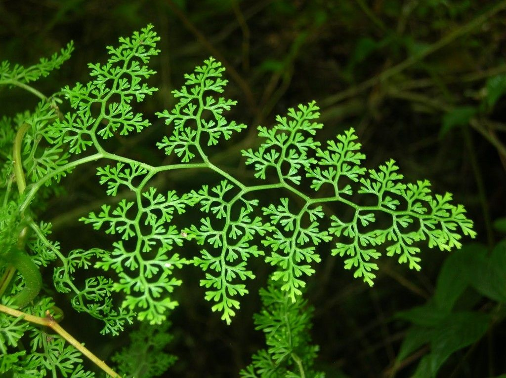
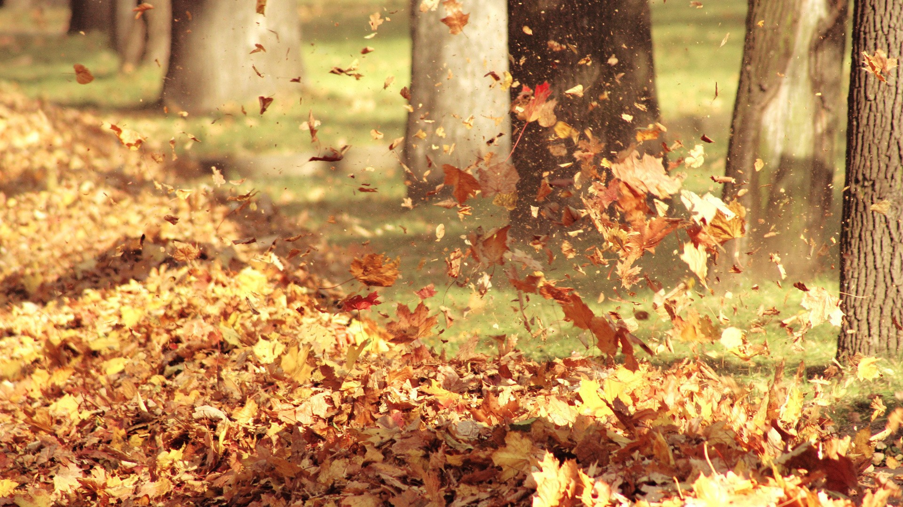
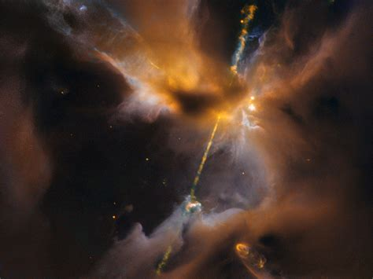
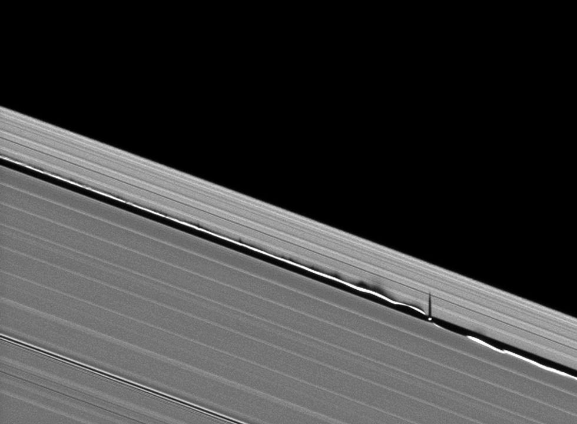
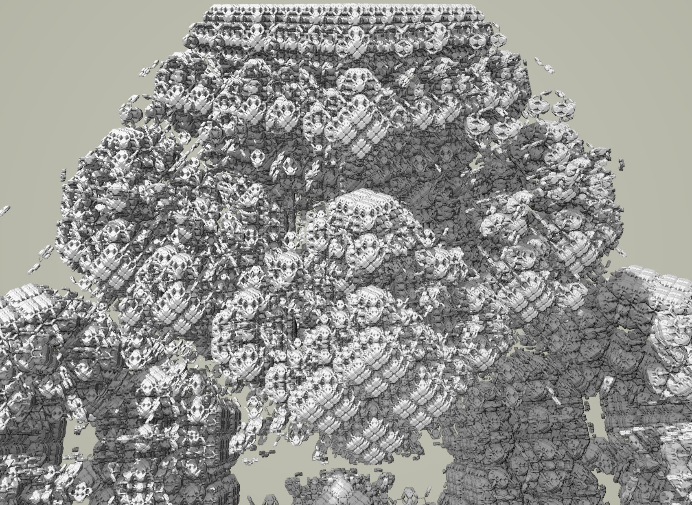

# Breathing in Game

Putting bio-rhythms on the screen is a really neat way to embody the Player in the game avatar.
To help with this immersion, game objects might synchronize their properties with this cycle.
The user can then intuit the rhythm without breaking attention from the avatar or game world.
Architecturally, this implies a single point of reference in the game session which any component can look up the current value.

- Breathing
  - Rate is voluntary so avatar can lead player
  - 4 phases with different durations (Exhale, wait, inhale, hold)
  - Currently using a crude sinusoidal easing...
  - Should you be able to dynamically alter each phase duration in game?
    - does it immediately take effect and if so what about boundary conditions?
    - does it schedule the change for the next cycle?

What should this rhythm affect on screen?

# Simulation / Generative Fractals

Having the Player's avatar be part of a simulation or generative fractal would be a neat way to make the player feel they are a contiguous part of the world and have control over it.

The style of control you give the Player over the simulation could have a strong proteus effect as well; are they large or small in the world? Do they create or erode material?

The scenarios are intended to be non-adversarial and exploratory. They should be compatible with the core mechanic of matching yoga poses.

Technologically there should be a lot of prior art, implemented in the browser.

## Fern Fractal Druid

 - We could use an IFS to draw plants on the screen
 - every inhale could cause the stems to grow and fork
 - Player's limb position/angle could alter the direction limbs are growing, and to a lesser extent, move the existing stems for intuitive positioning feedback to the user.
 - The goal could be guiding the plants to open space and light as dappled shadows are cast on the plant.
   - we can use a second graphics context to render it once, then draw it twice. A transform can be applied to make one look like a direct shadow. Or xor'd into a shadow mask, etc.
 - different species of plant will have different growth patterns to control
 - this mode implies breath control and balancing/stretching the body in reaching poses...

 

## Sand Simulation

 - Player is a gigantic Golem, inhaling draws sand from legs, exhale drops sand
 - Sand pours out of the user's head, off shoulders and down their arms, building hills on the ground
 - Player is very slow; a day passes with each breath.
 - Bury the monuments and aqueducts of a lemurian civilization, lost to time
 - divert a river, causing erosion
 - dig them back up after the ecological shift of an epoch
 - this mode might imply more methodical motions, with arched poses, focused downwards. Horse stance for endurance training?

 

 https://www.flickr.com/photos/dpicto/21185589974/

## Compressible Fluid

 - Exhaling moves the boughs of autumn trees, dropping leaves.
 - we could put avatar in a compressible liquid simulation where their limbs could shed vortices and flutter the leaves.
   - need graphics acceleration, but might be attainable with a coarse grid.
 - Particle traces could show the velocity field.
 - Playfully keep leaves in the air, or knock down piles with Hadoukens of air.
 - this mode implies a more active session with taichi-like round motions

## N-body Gravitation

- Player floats in the void, their extremities are celestial objects to which emerging constellations respond.
- attract with gravity, repel with stellar bursts?
- shepard an accretion disc from dust
- After star ignition, clear the dust from a Herbig-Haro object
- Guide planets too/from each other as they emerge from the stellar disc.
- or maybe feed a black hole, making the game quieter?
- viewpoint? 
  - top-down, user is in center of spiral?
  - small angle above the plane of the system, so user can see small, distant bodies traveling the opposite direction before they enter on the interactive foreground?
- Wandering black hole, moving between systems to feed?
- This would be an active and unpredictable session with more exertion; gravity produces chaotic and rapid motions. Difficult to combine with static posing mechanic.

https://jean-baptiste-faure.blogspot.com/2015/12/herbig-haro-object-24-hh-24.html

## Ray-marched Modulo Fractals

- Like IFS fractals but solid and infinite, very psychedelic!
- Can be real-time but you need graphics acceleration, not sure how strong, lol.
  - perhaps a simpler Mandelbrot could be explored?
- Like IFS, use limb orientations as seeds to fractal's transforms
- Awesome dynamic examples from the dev of 'Hyperbolica'.
  - https://www.youtube.com/watch?v=N8WWodGk9-g
- The game could be based around a posing your body to explore the space;
  - Instead of watching your avatar to get the configuration, the player tries poses until they find the target.
  - This target is a set of limb coefficients, which is a unique infinite fractal, so devs would tag a point in the search space that look like being at the base of a soaring tower- or viewing an endless city from space, etc.
  - breathing will slightly rotate the configuration, making it look like the world is breathing as well.
  - Warm/cold feedback can come from color changes as the user gets closer to the correct pose.
- This game state would be more focused on mind-body connection because they have to individually move specific limbs in specific directions to 'travel' on the psychic plane.

http://blog.hvidtfeldts.net/index.php/2015/01/path-tracing-3d-fractals/

More info;

Here is the rendering technique cleverly incorporated into a game;

https://www.youtube.com/watch?v=9U0XVdvQwAI

here is a brief description of the fractal;

https://www.youtube.com/watch?v=svLzmFuSBhk

Sebastian Lague also has made an implementation;

https://www.youtube.com/watch?v=Cp5WWtMoeKg

## Cohomology fractals

- Fast New fractal developed by Henry Segerman and co.
- might be worth brainstorming how this could be a play-space...

pretty sure the second half of this video is a troll, lol;

https://www.youtube.com/watch?v=fhBPhie1Tm0

Try turning on edges in the control panel so you can see how the world is 'stitched' together;

https://henryseg.github.io/cohomology_fractals/

# Other simulation types

- Incompressible fluid
  - Player stands waist-height in deep ocean
  - waterspouts fly from their arms and waves rise with their legs
  - Not sure where this can go. Put out fires? erode cliffs on the shore?

- Rigid body simulator
  - player's poses interact with polyhedra on the screen
  - goal is to stack or move them?

- Boids/Flocking
  - might need to help birds migrate as a mechanic
  - could just be a nice effect; birds might startle and settle on the sand golem as it moves. Provides scale. 

# Where to go from here

Too many directions, what is the best way to go?

Is this kind of riffing useful?
Are there other brainstorms I should listen to?

I think the fern fractal druid scenario is the most compatible with commodity hardware, quickest to implement, and most compatible with the pose sequence mechanic. Importantly, I know I can make it pretty.

Ray marched fractals have a visual 'wow' factor and there are a ton of example implementations we could port to webGL. Unclear how optimized you can make it. 

Also, the search mechanic by having different body parts control different operations in the fractal transform seems like a promising mechanic? It could be both free form, or we could lead them to traditional poses using warm/cold cues. Straddling that line of giving form to the game but not being controlling. It seems useful for the Player's mind-muscle connection too.

How important is the static pose mechanic? Is pose the ultimate metric? Or do we position targets, contrive mappings, and alter simulation objects such that they are an emergent behavior?

A literal sandbox mode seems fun. I like the idea of the Player's avatar directly transformed with new abilities.

If you carefully limit the N-body simulation it is achievable, but not sure how to make the gameplay work. Also, numerical stability is a hidden gotcha for this type of sim(fluids too).

Anything that requires WebGL could be a bit of a learning curve and add hardware requirements.
Also, I think it has a greater potential for novel interactivity.

