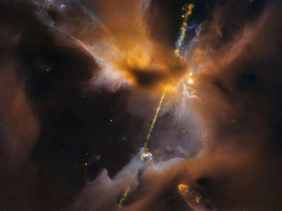
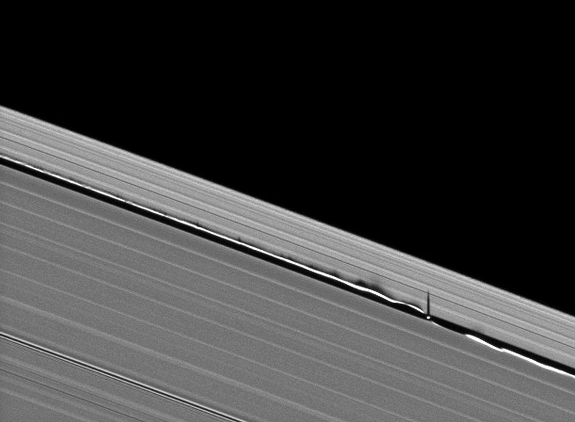

# Breathing in Game

Putting bio-rhythms on the screen could be a really neat way to embody the Player in the game avatar.
As you suggested before, a hud meter seems inappropriate for this.
Instead we could have some global timer which all game objects can refer to. Game objects could then synchronize motions or properties with this cycle.
This way the user can intuit the rhythm without breaking attention from the avatar or game world.

## Breathing

- Rate is voluntary so avatar can lead player
- 4 phases with different durations (Exhale, wait, inhale, hold)
- Currently using a crude sinusoidal easing...
- Should you be able to dynamically alter each phase duration in game?
  - does it immediately take effect and if so what about boundary conditions?
  - does it schedule the change for the next cycle?

## Heartbeat

  - intermittent double pulse
  - rate is not voluntary
  - more likely for user to perceive it while holding breath...

On the downside we can't synchronize these with the player's actual rhythms.
This is less an issue with breathing, as the player is using it as a target.
But the heart rate is not voluntary! 

# Heartbeat Solutions;

We should just shelve it for now... But if we do go after it;

## Heartrate calibration

  - After exertion, Enter mini-game state where raising arms controls game heart-rate. User has to synchronize pulses while listening to their body.
  - Downside is if exertion level changes the heart-rate will be off, leading to the same disembodiment.
  - We could make heart rate a very slight game effect, but ramp it up during these stages?
  - It would provide good data points over time of heart-rate variability; an important health metric.

## Bio-Sensor

  - Most accurate, but adds hardware needs- defeating one of the main objectives of the project!
  - but really cool; imagine background trees cycling through the seasons with the cycles of your breath.
  - a heart monitor could give awesome feedback for exertion targets;
    - if the rate gets too high or low, switch game modes to higher/lower exertion modes
    - This way you can keep the player in specific cardio zones
      - Very good for player's physical health as well!
  - WebSerial could be an avenue on chromium? 
  - Watch/fitness band apps? These things are getting more common...

# rhythm Game Effects

What should these rhythms affect on screen?

Having the Player's avatar be part of a simulation or generative fractal would be a strong tool to making the Player feel their body is part of the game.

The style of control you give the Player over the simulation could have a strong proteus effect as well; are they large or small in the world? Do they create or erode material?

## Fern Fractal

 - We could use an IFS to draw plants on the screen
 - every inhale could cause the stems to grow and fork
 - Player limb position and/or relative angle could alter the direction limbs are growing, and to a lesser extent, move the existing stems
 - goal could be to guide the plants to open space and light as shadows are cast on the plant.
 - different species of plant will have different growth patterns to control
 - this mode implies breath control and balancing/stretching the body in reaching poses...

 

## Compressible Fluid

 - Exhaling moves the boughs of autumn trees, dropping leaves.
 - we could put avatar in a compressible liquid simulation where their limbs could shed vortices and flutter the leaves.
 - Particle traces could show the velocity field.
 - Playfully keep leaves in the air, or knock down piles with Hadoukens of air.
 - this mode implies a more active session with taichi-like round motions

## Sand Simulation

 - Player is a Golem, inhaling stores sand, exhale drops sand
 - Sand pours out of the user's head, off shoulders and down their arms, building hills on the ground
 - bury the monuments and aqueducts of a lemurian civilization
 - divert a river, causing erosion
 - dig them back up after the ecological shift of an epoch
 - this mode might imply more methodical motions, with arched poses, focused downwards. Horse stance for endurance training?

 
 https://www.flickr.com/photos/dpicto/21185589974/

## N-body Gravitation

- Player floats in the void, their extremities are massive celestial bodies to which emerging constellations respond.
- shepard an accretion disc from dust
- After star ignition, clear the dust from a Herbig-Haro object
- Guide planets too/from each other as they emerge from the stellar disc.
- or maybe feed a black hole, making the game quieter?
- viewpoint? 
  - top-down, user is in center of spiral?
  - small angle above the plane of the system, so user can see small, distant bodies traveling the opposite direction before they enter on the interactive foreground?
- Wandering black hole, moving between systems to feed?
- This would be an active and unpredictable session with more exertion; gravity produces chaotic and rapid motions.

https://jean-baptiste-faure.blogspot.com/2015/12/herbig-haro-object-24-hh-24.html

## Ray-marched Modulo Fractals

https://www.youtube.com/watch?v=N8WWodGk9-g

https://www.youtube.com/watch?v=9U0XVdvQwAI

https://www.youtube.com/watch?v=svLzmFuSBhk

https://www.youtube.com/watch?v=Cp5WWtMoeKg

- Like IFS fractals but solid and infinite, very psychedelic!
- Can be real-time but you need graphics acceleration, not sure how strong, lol.
- Like IFS, use limb orientations as seeds to fractal's transforms
- Awesome examples from the dev of 'Hyperbolica'.
- The game could be based around a posing your body to explore the space;
  - Instead of watching your avatar to get the configuration, the player tries poses until they find the target.
  - This target is a set of limb coefficients, which is a unique infinite fractal, so devs would tag a point in the search space that look like being at the base of a soaring tower- or viewing an endless city from space, etc.
  - breathing will slightly rotate the configuration, making it look like the world is breathing as well.
  - Warm/cold feedback can come from color changes as the user gets closer to the correct pose.
- This game state would be based around mind-body connection because they have to individually move specific limbs in specific directions to 'travel' on the psychic plane.

http://blog.hvidtfeldts.net/index.php/2015/01/path-tracing-3d-fractals/

## Cohomology fractals

- Fast New fractal developed by Henry Segerman and co.
- might be worth brainstorming how this could be a play-space...

https://www.youtube.com/watch?v=fhBPhie1Tm0

pretty sure the second half of this video is a troll...

https://henryseg.github.io/cohomology_fractals/

## Incompressible fluid

- Player stands waist-height in deep ocean
- waterspouts fly from their arms and waves rise with their legs
- Not sure where this can go. Put out fires? erode cliffs on the shore?

# Miscellany

- Where do I add the Breathing module in the architecture?
  - child of game session since most everything must know it?

- I noticed the target placement problem with my wide angle camera! Possible solution;
  - Have a subtle calibration where the avatar instructs the user to enter a 'T' or 'X' pose
    - Instructed to reach as wide as possible onscreen, subtly forcing the Player to get in the image plane of the camera.
  - measure on-screen limb length and scale all subsequent target poses accordingly.
  - should work as long as user doesn't move closer/further from screen;
    - Oh, you could also actively scale targets periodically updating limb-lengths for any poses perpendicular to the camera direction.

- Limb position has jitter which gives a tense feeling!
  - we might want to use some smoothing (time average or alpha-beta)

- Limb occlusion makes limb position jump!
  - discard position outliers?
  - identify sideways bodies when torso width is thin?

